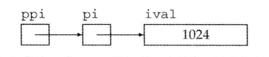

### 指针

> int *p;      //**指向int型对象**的指针

- 是一种 `"指向（point to）"`另外一种类型的复合类型。
    - 与引用类似：是对**其他对象**对间接访问
    - 指针本身就是一个对象，允许对指针进行赋值和拷贝，在一个指针的**生命周期**内，可以先后指向不同的对象
    - 因为指针本身就是一个对象，可以不在定义时赋初值

- **定义**指针类型： `int *ip1;`，**从右向左读有助于阅读**，`ip1`是指向`int`类型的指针。

- 指针存放某个对象的**地址**。

- 获取对象的地址： `int i=42; int *p = &i;`。 `&`是**取地址符**。

- 指针的类型与所指向的对象类型必须一致（均为同一类型int、double等）

- 指针的值的四种状态：
  - 1.指向一个对象；
  - 2.指向紧邻对象的下一个位置；
  - 3.空指针；
  - 4.无效指针。
  - >**对无效指针的操作均会引发错误**
  
- 指针访问对象： `cout << *p;`输出p指针所指对象的数据， `*`是**解引用符**。

```
某些符号有多重含义
int i = 42;
int &r = i; // &紧随类型名出现，因此是声明的一部分，上是一个引用
int *p; // *紧随类型名出现，因此是声明的一部分，P 是 一个指针
p = &i; // &出现在表达式中，是一个取地址符
*p = 1; // *出现在表达式中，是一个解引用符
int &r2 = *p; // &是声明的一部分，*是一个解引用符
```

- 空指针不指向任何对象。使用`int *p=nullptr;`来使用空指针。

- > 指针和引用的区别：引用本身并非一个对象，引用定义后就不能绑定到其他的对象了；指针并没有此限制，相当于变量一样使用。

- > 赋值语句永远改变的是**左侧**的对象。

- `void*`指针可以存放**任意**对象的地址。因无类型，仅操作内存空间，对所存对象无法访问。

- 其他指针类型必须要与所指对象**严格匹配**。

- 两个指针相减的类型是`ptrdiff_t`。

- 建议：初始化所有指针。

- 定义多个变量时：
    - `int* p1, p2;//*是对p1的修饰，所以p2还是int型`
    - `int *p1, *p2; //p1 p2均是指向int型的指针`
- #### optional
    - 指向指针的指针：`**`
    ```
    int ival = 1024;
    int *pi = &ival;
    int **ppi = &pi;
    ```
    

## const限定符

- 动机：希望定义一些不能被改变值的变量。

### 初始化和const
- const对象**必须初始化**，且**不能被改变**。
- const变量默认不能被其他文件访问，非要访问，必须在指定const定义之前加extern。要想在多个文件中使用const变量共享，定义和声明都加extern关键字即可。

### const的引用

- **reference to const**（对常量的引用）：指向const对象的引用，如 `const int ival=1; const int &refVal = ival;`，可以读取但不能修改`refVal`。
- **临时量**（temporary）对象：当编译器需要一个空间来暂存表达式的求值结果时，临时创建的一个未命名的对象。
- 对临时量的引用是非法行为。

### 指针和const

- **pointer to const**（指向常量的指针）：不能用于改变其所指对象的值, 如 `const double pi = 3.14; const double *cptr = &pi;`。
- **const pointer**：指针本身是常量，也就是说指针固定指向该对象，（存放在指针中的地址不变，地址所对应的那个对象值可以修改）如 `int i = 0; int *const ptr = &i;`

### 顶层const

- `顶层const`：指针本身是个常量。
- `底层const`：指针指向的对象是个常量。拷贝时严格要求相同的底层const资格。

### auto类型说明符 c++11

- **auto**类型说明符：让编译器**自动推断类型**。
- 一条声明语句只能有一个数据类型，所以一个auto声明多个变量时只能相同的变量类型(包括复杂类型&和*)。`auto sz = 0, pi =3.14//错误`
- `int i = 0, &r = i; auto a = r;` 推断`a`的类型是`int`。
- 会忽略`顶层const`。
- `const int ci = 1; const auto f = ci;`推断类型是`int`，如果希望是顶层const需要自己加`const`

### decltype类型指示符

- 从表达式的类型推断出要定义的变量的类型。
- **decltype**：选择并返回操作数的**数据类型**。
- `decltype(f()) sum = x;` 推断`sum`的类型是函数`f`的返回类型。
- 不会忽略`顶层const`。
- 如果对变量加括号，编译器会将其认为是一个表达式，如int i-->(i),则decltype((i))得到结果为int&引用。
- 赋值是会产生引用的一类典型表达式，引用的类型就是左值的类型。也就是说，如果 i 是 int，则表达式 i=x 的类型是 int&。

## 自定义数据结构

### struct

> 尽量不要吧类定义和对象定义放在一起。如`struct Student{} xiaoming,xiaofang;`
- 类可以以关键字`struct`开始，紧跟类名和类体。
- 类数据成员：类体定义类的成员。
- `C++11`：可以为类数据成员提供一个**类内初始值**（in-class initializer）。

## 迭代语句（插播）

- **if**： 
```
if (condition)
    statement
```
- **if else**: 
```
if(condition) 
    statement
else
    statement2
```

- **while**：当不确定到底要迭代多少次时，使用 `while`循环比较合适，比如读取输入的内容。
```while (condition)
    statemet
```
- **for**： `for`语句可以省略掉 `init-statement`， `condition`和 `expression`的任何一个；**甚至全部**。
```
for (inti-statement; condition; expression)
    statement
```
- **范围for**： 
```
for (declaration: expression) 
    statement
```

## string
- 标准库类型`string`表示可变长的字符序列。
- `#include <string>`，然后 `using std::string;`
- **string对象**：注意，不同于字符串字面值。
  
### 定义和初始化string对象

初始化`string`对象的方式：

| 方式 | 解释 |
| -- | -- |
| `string s1` | 默认初始化，`s1`是个空字符串 |
| `string s2(s1)` | `s2`是`s1`的副本 |
| `string s2 = s1` | 等价于`s2(s1)`，`s2`是`s1`的副本 |
| `string s3("value")` | `s3`是字面值“value”的副本，除了字面值最后的那个空字符外 |
| `string s3 = "value"` | 等价于`s3("value")`，`s3`是字面值"value"的副本 |
| `string s4(n, 'c')` | 把`s4`初始化为由连续`n`个字符`c`组成的串 |

- 拷贝初始化（copy initialization）：使用等号`=`将一个已有的对象拷贝到正在创建的对象。
- 直接初始化（direct initialization）：通过括号给对象赋值。

### string对象上的操作

`string`的操作：

| 操作 | 解释 |
|-----|-----|
| `os << s` | 将`s`写到输出流`os`当中，返回`os` |
| `is >> s` | 从`is`中读取字符串赋给`s`，字符串以空白分割，返回`is` |
| `getline(is, s)` | 从`is`中读取一行赋给`s`，返回`is` |
| `s.empty()` | `s`为空返回`true`，否则返回`false` |
| `s.size()` | 返回`s`中字符的个数 |
| `s[n]` | 返回`s`中第`n`个字符的引用，位置`n`从0计起 |
| `s1+s2` | 返回`s1`和`s2`连接后的结果 |
| `s1=s2` | 用`s2`的副本代替`s1`中原来的字符 |
| `s1==s2` | 如果`s1`和`s2`中所含的字符完全一样，则它们相等；`string`对象的相等性判断对字母的大小写敏感 |
| `s1!=s2` | 同上 |
| `<`, `<=`, `>`, `>=` | 利用字符在字典中的顺序进行比较，且对字母的大小写敏感（对第一个不相同的位置进行比较） |

- string io：
    - 执行读操作`>>`：忽略掉开头的空白（包括空格、换行符和制表符），直到遇到下一处空白为止。
    - `getline`：读取一整行，**包括空白符**。
- `s.size()`返回的时`string::size_type`类型，记住是一个**无符号**类型的值，不要和`int`混用
- `s1+s2`使用时，保证至少一侧是string类型。`string s1 = "hello" + "world" // 错误，两侧均为字符串字面值`
- **字符串字面值和string是不同的类型。**

### 处理string对象中的字符

- **ctype.h vs. cctype**：C++修改了c的标准库，名称为去掉`.h`，前面加`c`。
  > 如c++版本为`cctype`，c版本为`ctype.h`
  - **尽量使用c++版本的头文件**，即`cctype`

`cctype`头文件中定义了一组标准函数：

| 函数 | 解释 |
|-----|-----|
| `isalnum(c)` | 当`c`是字母或数字时为真 |
| `isalpha(c)` | 当`c`是字母时为真 |
| `iscntrl(c)` | 当`c`是控制字符时为真 |
| `isdigit(c)` | 当`c`是数字时为真 |
| `isgraph(c)` | 当`c`不是空格但可以打印时为真 |
| `islower(c)` | 当`c`是小写字母时为真 |
| `isprint(c)` | 当`c`是可打印字符时为真 |
| `ispunct(c)` | 当`c`是标点符号时为真 |
| `isspace(c)` | 当`c`是空白时为真（空格、横向制表符、纵向制表符、回车符、换行符、进纸符） |
| `isupper(c)` | 当`c`是大写字母时为真 |
| `isxdigit(c)` | 当`c`是十六进制数字时为真 |
| `tolower(c)` | 当`c`是大写字母，输出对应的小写字母；否则原样输出`c` |
| `toupper(c)` | 当`c`是小写字母，输出对应的大写字母；否则原样输出`c` |

- 遍历字符串：使用**范围for**（range for）语句： `for (auto c: str)`，或者 `for (auto &c: str)`使用引用直接改变字符串中的字符。 （C++11）