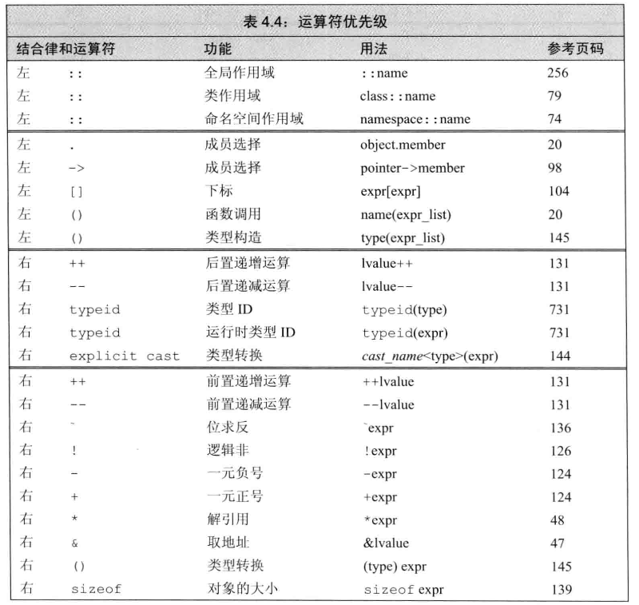

# 第四章 表达式

## 表达式基础

- **运算对象转换**：小整数类型会被提升为较大的整数类型
- **重载运算符**：当运算符作用在类类型的运算对象时，用户可以自行定义其含义。
- **左值和右值**：
    - C中原意：左值**可以**在表达式左边，右值不能。
    - `C++`：当一个对象被用作**右值**的时候，用的是对象的**值**（内容）；
    - 被用做**左值**时，用的是对象的**身份**（在内存中的位置）。
- **优先级和结合律**：运算按结合律判断先后次序，括号无视优先级。
- **求值顺序**：`int i = f1() + f2()`
  - 先计算`f1() + f2()`,再计算`int i = f1() + f2()`。但是f1和f2的计算**先后不确定**
  - 但是，如果f1、f2都对同一对象进行了修改，因为顺序不确定，所以会编译出错，显示未定义

## 算术运算符

- **溢出**：当计算的结果超出该类型所能表示的范围时就会产生溢出。
- **bool类型不应该参与计算**
  ```cpp
  bool b=true;
  bool b2=-b;   //仍然为true
  //b为true，提升为对应int=1，-b=-1
  //b2=-1≠0，所以b2仍未true
  ```
- 取余运算m%n，结果符号与m相同

## 逻辑运算符

- **短路求值**：逻辑与运算符和逻辑或运算符都是先求左侧运算对象的值再求右侧运算对象的值，当且仅当左侧运算对象无法确定表达式的结果时才会计算右侧运算对象的值。**先左再右**


## 赋值运算符

- 赋值运算的**返回结果时它的左侧运算对象**，且是一个左值。类型也就是左侧对象的类型。
- 如果赋值运算的左右侧运算对象类型不同，则右侧运算对象将转换成左侧运算对象的类型。
- 赋值运算符满足**右结合律**，这点和其他二元运算符不一样。 `ival = jval = 0;`等价于`ival = (jval = 0);`
- 赋值运算优先级比较低，使用其当条件时应该加括号。
- 复合赋值运算符，**复合运算符只求值一次**，普通运算符求值两次。（对性能有一点点点点影响）
  任意复合运算符op等价于`a = a op b;`

## 递增递减运算符

* 前置版本`j = ++i`，先加一后赋值
* 后置版本`j = i++`，先赋值后加一

**优先使用前置**版本，后置多一步储存原始值。（除非需要变化前的值）

### 混用解引用和递增运算符

`*iter++`等价于`*(iter++)`，递增优先级较高

```c++
auto iter = vi.begin();
while (iter!=vi.end()&&*iter>=0)
	cout<<*iter++<<endl;	// 输出当前值，指针向前移1
```

## 成员访问运算符

`ptr->mem`等价于`(*ptr).mem`

注意`.`运算符优先级大于`*`，所以记得加括号

## 条件运算符

- 条件运算符（`?:`）允许我们把简单的`if-else`逻辑嵌入到单个表达式中去，按照如下形式：`cond? expr1: expr2`

- 可以嵌套使用，**右结合律**，从右向左顺序组合

  - ```c++
    finalgrade = (grade > 90) ? "high pass"
        : (grade < 60) ? "fail" : "pass";
    //等价于
    finalgrade = (grade > 90) ? "high pass"
        : （(grade < 60) ? "fail" : "pass"）;
    ```

- 输出表达式使用条件运算符记得加括号，条件运算符优先级太低。

## 位运算符

用于检查和设置二进制位的功能。

- 位运算符是作用于**整数类型**的运算对象。
- 二进制位向左移（`<<`）或者向右移（`>>`），移出边界外的位就被舍弃掉了。
- 位取反（`~`）（逐位求反）、与（`&`）、或（`|`）、异或（`^`）

有符号数负值可能移位后变号，所以强烈建议**位运算符仅用于无符号数**。

应用：

```c++
unsigned long quiz1 = 0;    // 每一位代表一个学生是否通过考试
1UL << 12;  // 代表第12个学生通过
quiz1 |= (1UL << 12);   // 将第12个学生置为已通过
quiz1 &= ~(1UL << 12);  // 将第12个学生修改为未通过
bool stu12 = quiz1 & (1UL << 12);   // 判断第12个学生是否通过
```

> 位运算符使用较少，但是重载cout、cin大家都用过

位运算符满足左结合律，优先级介于中间，使用时尽量加括号。

## sizeof运算符

- 返回一条表达式或一个类型名字所占的**字节数**。
- 返回的类型是 `size_t`的常量表达式。
- `sizeof`并不实际计算其运算对象的值。
- 两种形式：
  1. `sizeof (type)`，给出类型名
  2. `sizeof expr`，给出表达式
- 可用sizeof返回数组的大小

```c++
int ia[10];
// sizeof(ia)返回整个数组所占空间的大小
// sizeof(ia)/sizeof(*ia)返回数组的大小
constexpr size_t sz = sizeof(ia)/sizeof(*ia);
int arr[sz];
```

## 逗号运算符

从左向右依次求值。

## 类型转换

### 隐式类型转换

> 设计为尽可能避免损失精度，即转换为更精细类型。

- 比 `int`类型小的整数值先提升为较大的整数类型。
- 条件中，非布尔转换成布尔。
- 初始化中，初始值转换成变量的类型。
- 算术运算或者关系运算的运算对象有多种类型，要转换成同一种类型。
- 函数调用时也会有转换。

#### 算术转换

##### 整型提升

* 常见的char、bool、short能存在int就会转换成int，否则提升为`unsigned int`
* `wchar_t,char16_t,char32_t`提升为整型中`int,long,long long ……`最小的，且能容纳原类型所有可能值的类型。

#### 其他转换

> p143

### 显式类型转换（尽量避免）

- **static_cast**：任何明确定义的类型转换，只要不包含底层const，都可以使用。 `double slope = static_cast<double>(j);`

- **dynamic_cast**：支持运行时类型识别。

- **const_cast**：只能改变运算对象的底层const，一般可用于去除const性质。 `const char *pc; char *p = const_cast<char*>(pc)`

  > 只有其可以改变常量属性

- **reinterpret_cast**：通常为运算对象的位模式提供低层次上的重新解释。

#### 旧式强制类型转换

`type expr`

## 运算符优先级表

> p147



# 第五章 语句

## 简单语句

- **表达式语句**：一个表达式末尾加上分号，就变成了表达式语句。
- **空语句**：只有一个单独的分号。
- **复合语句（块）**：用花括号 `{}`包裹起来的语句和声明的序列。一个块就是一个作用域。

## 条件语句
- **if**： 
```
if (condition)
    statement
```
- **if else**: 
```
if(condition) 
    statement
else
    statement2
```
- **悬垂else**（dangling else）：用来描述在嵌套的`if else`语句中，如果`if`比`else`多时如何处理的问题。C++使用的方法是`else`匹配最近没有配对的`if`。
- **switch**: 
```
switch(expression) {
  case x:
    // code block
    break;
  case y:
    // code block
    break;
  default:
    // code block
}
```

## 迭代语句

- **while**：当不确定到底要迭代多少次时，使用 `while`循环比较合适，比如读取输入的内容。
```
while (condition)
    statement
```
- **for**： `for`语句可以省略掉 `init-statement`， `condition`和 `expression`的任何一个；**甚至全部**。
```
for (init-statement; condition; expression)
    statement
```
- **范围for**：更简单的for，用来遍历一个容器内所有元素 
```
for (declaration: expression) 
    statement
```

## 跳转语句

- **break**：`break`语句负责终止离它最近的`while`、`do while`、`for`或者`switch`语句，并从这些语句之后的第一条语句开始继续执行。
- **continue**：终止最近的循环中的当前迭代并立即开始下一次迭代。只能在`while`、`do while`、`for`循环的内部。

## try语句块和异常处理

- **throw表达式**：异常检测部分使用 `throw`表达式来表示它遇到了无法处理的问题。我们说 `throw`引发 `raise`了异常。
- **try语句块**：以 `try`关键词开始，以一个或多个 `catch`字句结束。 `try`语句块中的代码抛出的异常通常会被某个 `catch`捕获并处理。 `catch`子句也被称为**异常处理代码**。
- **异常类**：用于在 `throw`表达式和相关的 `catch`子句之间传递异常的具体信息。