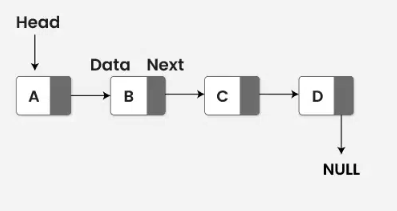

# 第六章 函数


### const形参和实参

- 形参的顶层`const`被忽略。`void func(const int i);`调用时既可以传入`const int`也可以传入`int`。
- 我们可以使用非常量初始化一个底层`const`对象，但是反过来不行。
- 在函数中，不能改变实参的**局部副本**。
- 尽量使用常量引用。

### 返回数组指针

- `Type (*function (parameter_list))[dimension]`
- 使用类型别名： `typedef int arrT[10];` 或者 `using arrT = int[10;]`，然后 `arrT* func() {...}`
- 使用 `decltype`： `decltype(odd) *arrPtr(int i) {...}`
- **尾置返回类型**： 在形参列表后面以一个`->`开始：`auto func(int i) -> int(*)[10]`（`C++11`）

## 函数重载

- **重载**：如果同一作用域内几个函数名字相同但形参列表不同，我们称之为重载（overload）函数。
- `main`函数不能重载。
- **重载和const形参**：
  - 一个有顶层const的形参和没有它的函数无法区分。 `Record lookup(Phone* const)`和 `Record lookup(Phone*)`无法区分。
  - 相反，是否有某个底层const形参可以区分。 `Record lookup(Account*)`和 `Record lookup(const Account*)`可以区分。
- **重载和作用域**：若在内层作用域中声明名字，它将隐藏外层作用域中声明的同名实体，在不同的作用域中无法重载函数名。

## 特殊用途语言特性

### 默认实参
    
- `string screen(sz ht = 24, sz wid = 80, char backgrnd = ' ');`
- 一旦某个形参被赋予了默认值，那么它之后的形参都必须要有默认值。

### 内联（inline）函数

- 普通函数的缺点：调用函数比求解等价表达式要慢得多。
- `inline`函数可以避免函数调用的开销，可以让编译器在编译时**内联地展开**该函数。
- `inline`函数应该在头文件中定义。

### constexpr函数

- 指能用于常量表达式的函数。
- `constexpr int new_sz() {return 42;}`
- 函数的返回类型及所有形参类型都要是字面值类型。
- `constexpr`函数应该在头文件中定义。

### 调试帮助

- `assert`预处理宏（preprocessor macro）：`assert(expr);`

开关调试状态：

`CC -D NDEBUG main.c`可以定义这个变量`NDEBUG`。

```cpp
void print(){
    #ifndef NDEBUG
        cerr << __func__ << "..." << endl;
    #endif
}
```

## 函数匹配

- 重载函数匹配的**三个步骤**：1.候选函数；2.可行函数；3.寻找最佳匹配。
- **候选函数**：选定本次调用对应的重载函数集，集合中的函数称为候选函数（candidate function）。
- **可行函数**：考察本次调用提供的实参，选出可以被这组实参调用的函数，新选出的函数称为可行函数（viable function）。
- **寻找最佳匹配**：基本思想：实参类型和形参类型越接近，它们匹配地越好。

## 函数指针

- **函数指针**：是指向函数的指针。
- `bool (*pf)(const string &, const string &);` 注：两端的括号不可少。
- **函数指针形参**：
  - 形参中使用函数定义或者函数指针定义效果一样。
  - 使用类型别名或者`decltype`。
- **返回指向函数的指针**：1.类型别名；2.尾置返回类型。

## 动态内存

- 动态内存管理：
  - `new`：在动态内存中为对象分配空间并返回一个指向该对象的指针。
  - `delete`：接受一个动态对象的指针，销毁该对象，并释放与之关联的内存。
  
# 链表
