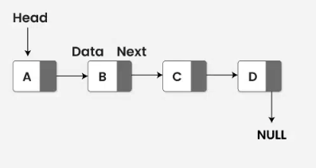

# 第六章 函数

## Review
### 类型别名

- 传统别名：使用**typedef**来定义类型的同义词。 `typedef double wages;`
- 新标准别名：别名声明（alias declaration）： `using SI = Sales_item;`（C++11）

### auto类型说明符 c++11

- **auto**类型说明符：让编译器**自动推断类型**。
- 一条声明语句只能有一个数据类型，所以一个auto声明多个变量时只能相同的变量类型(包括复杂类型&和*)。`auto sz = 0, pi =3.14//错误`
- `int i = 0, &r = i; auto a = r;` 推断`a`的类型是`int`。
- 会忽略`顶层const`。
- `const int ci = 1; const auto f = ci;`推断类型是`int`，如果希望是顶层const需要自己加`const`

### decltype类型指示符

- 从表达式的类型推断出要定义的变量的类型。
- **decltype**：选择并返回操作数的**数据类型**。
- `decltype(f()) sum = x;` 推断`sum`的类型是函数`f`的返回类型。
- 不会忽略`顶层const`。
- 如果对变量加括号，编译器会将其认为是一个表达式，如int i-->(i),则decltype((i))得到结果为int&引用。
- 赋值是会产生引用的一类典型表达式，引用的类型就是左值的类型。也就是说，如果 i 是 int，则表达式 i=x 的类型是 int&。

## 指针&数组追加
`int arr[10] = {0,1,2,3,4,5,6,7,8,9};`

`int *p1 = arr;`
- 指向数组元素的指针
- 使用方式：通过 p1，可以访问和修改数组中的元素。p1[0] 等同于 arr[0]
- 类型：int*

`int (*p2)[10] = &arr;`
- 指向整个数组的指针
- 使用方式：不能直接通过 p2 来访问数组的元素，因为 p2 是指向整个数组的。要访问数组元素，需要先解引用 p2，然后使用索引。
- e.g. (*p2)[1] 等同于 arr[1]。
- 类型：int (*)[10]

- 数组与指针等价
```
int val = 3;
int *p3 = &val;
cout << p3[0] << endl;
```

- 数组的类型别名
```
typedef int arrT[10];
arrT arr2 = {-1,-2,-3};
using arrT2 = int[10];
arrT2 arr3 = {2,4,6,8};
arrT* p4 = &arr2;
```

## 返回数组指针

- `Type (*function (parameter_list))[dimension]`
- 使用类型别名： `typedef int arrT[10];` 或者 `using arrT = int[10;]`，然后 `arrT* func() {...}`
- 使用 `decltype`： `decltype(odd) *arrPtr(int i) {...}`
- **尾置返回类型**： 在形参列表后面以一个`->`开始：`auto func(int i) -> int(*)[10]`（`C++11`）

声明一个返回数组指针类型的函数：Type (*function_name(parameter_list)) [dimension]
```
int (*func(int i)) [10];
拆解：
func(int i)表示调用func函数时需要一个int类型的实参
(*func(int i))意味着我们可以对函数调用的结果执行解引用操作
(*func(int i)) [10]表示解引用func的调用将得到一个大小是10的数组
int (*func(int i)) [10]表示数组中的元素是int类型

尾置返回类型
auto func(int i) -> int(*) [10];

使用decltype
const int odd[] = {1,3,5};
const int even[] = {2,4,6};
decltype(odd) *arrPtr(int i){
    return (i%2) ? &odd : &even;
}
```

## 函数指针

- **函数指针**：是指向函数的指针。
- **函数的类型**由它的返回值类型以及形参类型共同决定。
- `bool (*pf)(const string &, const string &);` 注：两端的括号不可少。
- **函数指针形参** (回调函数 callback function)：
  - 形参中使用函数定义或者函数指针定义效果一样。
  - 使用类型别名或者`decltype`。
- **返回指向函数的指针**：1.类型别名；2.尾置返回类型。


### 内联（inline）函数

- 普通函数的缺点：调用函数比求解等价表达式要慢得多。
- `inline`函数可以避免函数调用的开销，可以让编译器在编译时**内联地展开**该函数。
- `inline`函数应该在头文件中定义。

### constexpr函数

- 指能用于常量表达式的函数。
- `constexpr int new_sz() {return 42;}`
- 函数的返回类型及所有形参类型都要是字面值类型。
- `constexpr`函数应该在头文件中定义。

### 调试帮助

- `assert`预处理宏（preprocessor macro）：`assert(expr);`

开关调试状态：

`CC -D NDEBUG main.c`可以定义这个变量`NDEBUG`。

```cpp
void print(){
    #ifndef NDEBUG
        cerr << __func__ << "..." << endl;
    #endif
}
```

## 函数匹配

- 重载函数匹配的**三个步骤**：1.候选函数；2.可行函数；3.寻找最佳匹配。
- **候选函数**：选定本次调用对应的重载函数集，集合中的函数称为候选函数（candidate function）。
- **可行函数**：考察本次调用提供的实参，选出可以被这组实参调用的函数，新选出的函数称为可行函数（viable function）。
- **寻找最佳匹配**：基本思想：实参类型和形参类型越接近，它们匹配地越好。


## 动态内存

- 动态内存管理：
  - `new`：在动态内存中为对象分配空间并返回一个指向该对象的指针。
  - `delete`：接受一个动态对象的指针，销毁该对象，并释放与之关联的内存。
  
# 链表
