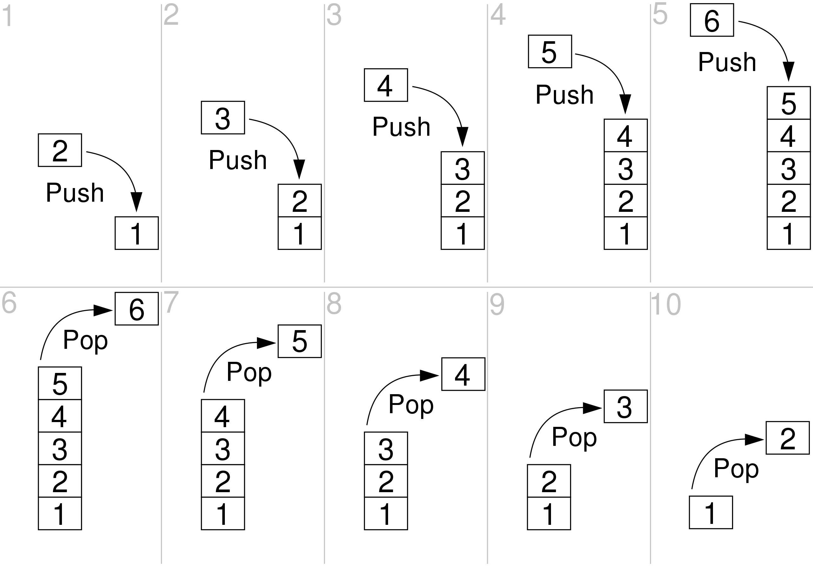
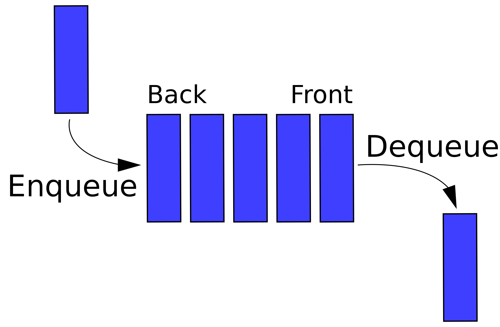

# 计算机复杂度
## 时间复杂度
- 算法的时间复杂度（time complexity）是一个函数，它定性描述该算法的运行时间。这是一个代表算法输入值的字符串的长度的函数。时间复杂度常用大O符号表述 O(x)，不包括这个函数的低阶项和首项系数。
- 时间复杂度可被称为是**渐近**的，亦即考察输入值大小趋近无穷时的情况。

### 常见的时间复杂度量级有：
- 常数阶O(1)
- 对数阶O(logN)
- 线性阶O(n)
- 线性对数阶O(nlogN)
- 平方阶O(n²)
- 立方阶O(n³)
- K次方阶O(n^k)
- 指数阶(2^n)

## 空间复杂度
### 空间复杂度是对一个算法在运行过程中临时占用存储空间大小的一个量度，同样反映的是一个趋势

### 常见的时间复杂度
O(1), O(n), O(n^2)...


# 类 （Class）

## 定义抽象数据类型

- **类背后的基本思想**：**数据抽象**（data abstraction）和**封装**（encapsulation）。
- 数据抽象是一种依赖于**接口**（interface）和**实现**（implementation）分离的编程技术。

### 类成员 （Member）

- 必须在类的内部声明，不能在其他地方增加成员。
- 成员可以是数据，函数，类型别名。

### 类的成员函数

- 成员函数的**声明**必须在类的内部。
- 成员函数的**定义**既可以在类的内部也可以在外部。

### 访问类的成员
- 使用点运算符 `.` 访问成员。

### 类的定义
```
类关键字 类名
class classname{
    访问修饰符(public, private, protected)
    Access specifier: 
        成员变量
        VariableType variable;
        成员函数
        VariableType function(){...}
        一些特殊成员函数：
        构造函数，在每次创建新的对象时运行，函数名和类名一致
        析构函数，在每次销毁对象时运行，函数名为～加类名
};  分号结束一个类的定义
```

## 常见数据结构
### 堆栈(stack)

- 堆栈存储一组数据，其操作主要遵循后进先出（LIFO, Last-In-First-Out）的原则。这意味着最后一个加入堆栈的元素将是第一个被移除的元素。堆栈提供了一种非常直观的方式来管理数据，特别是在需要反转元素顺序或仅处理元素的一端时。

- 基本操作
    - Push（压栈）O(1)：将一个元素添加到堆栈的顶部。
    - Pop（弹栈）O(1)：移除并返回堆栈顶部的元素。
    - Top（查看栈顶元素）O(1)：返回堆栈顶部的元素，但不从堆栈中移除它。
    - IsEmpty（检查是否为空）O(1)：检查堆栈是否为空，如果没有元素则返回真（true）。
    - Size（获取栈的大小）O(1)：返回堆栈中的元素数量。
    - 搜索 O(n)
- 特点和用途：
堆栈的这些特性使它非常适用于需要逆序处理数据或者只需访问数据集中的最后一个元素的场景。

### 队列(queue)

队列是一种先进先出（FIFO, First-In-First-Out）的数据结构，主要支持两种操作：入队（enqueue）和出队（dequeue），以及访问队首元素
- 基本操作
    - enqueue O(1)：向队列添加元素（入队）
    - dequeue O(1)：从队列中移除元素（出队）
    - front O(1)：获取队首元素


### 链表（Linked List）
- 链表是一种线性数据结构，它不像数组那样在内存中连续存储，而是由一系列节点组成，每个节点包含数据部分和指向下一个节点的指针（单向链表）或同时指向前一个和下一个节点的指针（双向链表）。

- 链表的非连续存储允许在不重新调整整个数据结构的情况下动态地插入和删除节点，这使得链表在需要频繁执行这些操作的场景中非常有用。

- 常见的链表类型
    - 单向链表（Singly Linked List）：每个节点只有一个指向下一个节点的指针。
    - 双向链表（Doubly Linked List）：每个节点有两个指针，分别指向前一个和下一个节点。
    - 循环链表（Circular Linked List）：链表的最后一个节点指向第一个节点。
- 常见操作
- 插入（Insertion）
    - 在链表头插入（头插法）：O(1)。因为直接在头部添加节点，更新指针即可。
    - 在链表尾插入（尾插法）： O(n)，因为需要遍历整个链表找到最后一个节点；如果维护一个尾指针，则可以降低到 O(1)。双向链表通常维护一个尾指针，因此也是 O(1)。
    - 在中间某位置插入：O(n)
- 删除（Deletion）
    - 删除头节点：O(1)，直接移除头节点，并更新头指针。
    - 删除尾节点：O(n)，因为需要找到尾节点的前一个节点。双向链表可以是 O(1)，因为可以直接访问前一个节点。
- 查找（Search）：O(n)，因为可能需要遍历整个链表。

### 哈希表(hashmap)

- 哈希表（hashmap），用于存储键值对（key-value pairs），并允许快速的数据检索。它使用一个称为“哈希函数”的算法来计算数据存放的确切位置，从而实现对数据的快速访问
#### 核心概念
- 哈希函数：
哈希函数是哈希表的核心，它将键（key）转换为数组索引。
- 冲突解决：
尽管哈希函数努力均匀分布键，但冲突在实践中是不可避免的。解决冲突的常见策略包括：

    - 链表法（Separate Chaining）： 每个哈希表槽点（bucket）存储一个链表。所有映射到该索引的元素都会被添加到这个链表中。查找、插入和删除的时间复杂度可能变为 O(n) 在最坏的情况下，其中 n 是链表中的元素数量。
    - 开放地址法（Open Addressing）： 当发生冲突时，通过一种系统的方式探测其他的空槽，直到找到空槽为止。其中包括线性探测、二次探测和双重散列等方法。 

- 基本操作
    - 插入（Insert）O(1)： 使用哈希函数确定元素的存储位置，并处理可能的冲突。
    - 删除（Delete）O(1)： 定位元素位置，然后移除。
    - **查找（Search）O(1)**： 使用哈希函数找到元素的位置，进行访问。

### 优先队列(priority queue)
优先队列（Priority Queue）是一种特殊类型的队列，其中每个元素都有一定的优先级。元素被按优先级顺序从队列中取出：优先级最高的元素最先被取出（删除）。这不同于标准的队列，标准队列是先进先出的结构。
