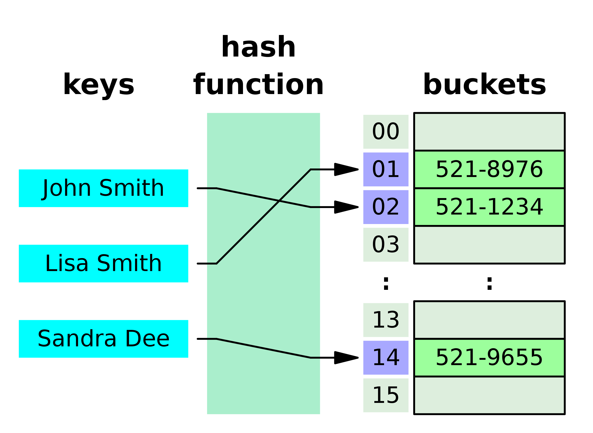

### 链表（Linked List）
- 链表是一种线性数据结构，它不像数组那样在内存中连续存储，而是由一系列节点组成，每个节点包含数据部分和指向下一个节点的指针（单向链表）或同时指向前一个和下一个节点的指针（双向链表）。

- 链表的非连续存储允许在不重新调整整个数据结构的情况下动态地插入和删除节点，这使得链表在需要频繁执行这些操作的场景中非常有用。

- 常见的链表类型
    - 单向链表（Singly Linked List）：每个节点只有一个指向下一个节点的指针。
    - 双向链表（Doubly Linked List）：每个节点有两个指针，分别指向前一个和下一个节点。
    - 循环链表（Circular Linked List）：链表的最后一个节点指向第一个节点。
- 常见操作
- 插入（Insertion）
    - 在链表头插入（头插法）：O(1)。因为直接在头部添加节点，更新指针即可。
    - 在链表尾插入（尾插法）： O(n)，因为需要遍历整个链表找到最后一个节点；如果维护一个尾指针，则可以降低到 O(1)。双向链表通常维护一个尾指针，因此也是 O(1)。
    - 在中间某位置插入：O(n)
- 删除（Deletion）
    - 删除头节点：O(1)，直接移除头节点，并更新头指针。
    - 删除尾节点：O(n)，因为需要找到尾节点的前一个节点。双向链表可以是 O(1)，因为可以直接访问前一个节点。
- 查找（Search）：O(n)，因为可能需要遍历整个链表。

### 哈希表(hashmap)

- 哈希表（hashmap），用于存储键值对（key-value pairs），并允许快速的数据检索。它使用一个称为“哈希函数”的算法来计算数据存放的确切位置，从而实现对数据的快速访问
#### 核心概念
- 哈希函数：
哈希函数是哈希表的核心，它将键（key）转换为数组索引。
- 冲突解决：
尽管哈希函数努力均匀分布键，但冲突在实践中是不可避免的。解决冲突的常见策略包括：

    - 链表法（Separate Chaining）： 每个哈希表槽点（bucket）存储一个链表。所有映射到该索引的元素都会被添加到这个链表中。查找、插入和删除的时间复杂度可能变为 O(n) 在最坏的情况下，其中 n 是链表中的元素数量。
    - 开放地址法（Open Addressing）： 当发生冲突时，通过一种系统的方式探测其他的空槽，直到找到空槽为止。其中包括线性探测、二次探测和双重散列等方法。 

- 基本操作
    - 插入（Insert）O(1)： 使用哈希函数确定元素的存储位置，并处理可能的冲突。
    - 删除（Delete）O(1)： 定位元素位置，然后移除。
    - **查找（Search）O(1)**： 使用哈希函数找到元素的位置，进行访问。

### 树(tree)
树，用来模拟具有树状结构性质的数据集合。它是由n（n>0）个有限节点组成一个具有层次关系的集合。把它叫做“树”是因为它看起来像一棵倒挂的树，也就是说它是根朝上，而叶朝下的。它具有以下的特点：

- 每个节点都只有有限个子节点或无子节点；
- 没有父节点的节点称为根节点；
- 每一个非根节点有且只有一个父节点；
- 除了根节点外，每个子节点可以分为多个不相交的子树；
- 树里面没有环路(cycle)

#### 二叉树(Binary tree)
二叉树是每个节点最多只有两个分支（即不存在分支度大于2的节点）的树结构

#### 二叉搜索树(Binary search tree)
性质：
- 若任意节点的左子树不空，则左子树上所有节点的值均小于它的根节点的值；
- 若任意节点的右子树不空，则右子树上所有节点的值均大于它的根节点的值；
- 任意节点的左、右子树也分别为二叉查找树；
- 其中，左子树中最大节点（前继）和右子树中的最小节点（后继）被称为继承者（successor）
时间复杂度：
- 搜索：O(logn)
- 插入：O(logn)
- 删除：O(logn)